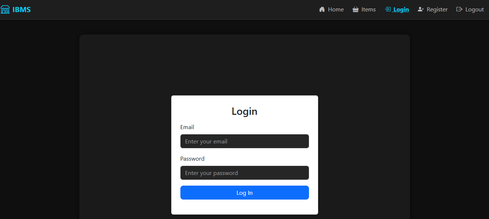
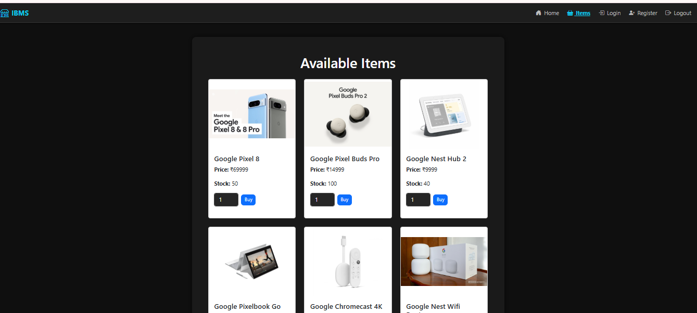
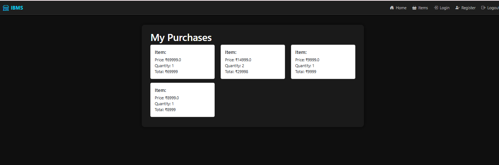

# Inventory and Building Management System (IBMS)


## 📌 Project Description
An **Inventory and Building Management System (IBMS)** developed using **Flask** and **Flask-SQLAlchemy** to manage inventory records, purchases, and billing efficiently. The system supports streamlined recordkeeping and resource allocation through a centralized management platform.

## 🎯 Impact
Streamlined inventory and billing workflows by providing an organized and efficient management system, reducing manual tracking and improving operational accuracy.

## 🛠️ Tech Stack
- Python
- Flask
- Flask-SQLAlchemy
- HTML, CSS, Bootstrap
- SQLite / PostgreSQL
## 📸 Screenshots

### 🧾 Inventory & Billing Dashboard


### 🔐 Login Page


### 📝 Register Page


### 📦 Items Page


### 🛒 Purchased Page



## ✨ Features
- User authentication (Register & Login)
- Inventory item management
- Purchase and billing records
- Centralized inventory & billing dashboard
- Secure data storage
- User-friendly interface

## 🚀 Local Setup Instructions
```bash
git clone https://github.com/your-username/your-repo-name.git
cd your-repo-name
pip install -r requirements.txt
python app.py
